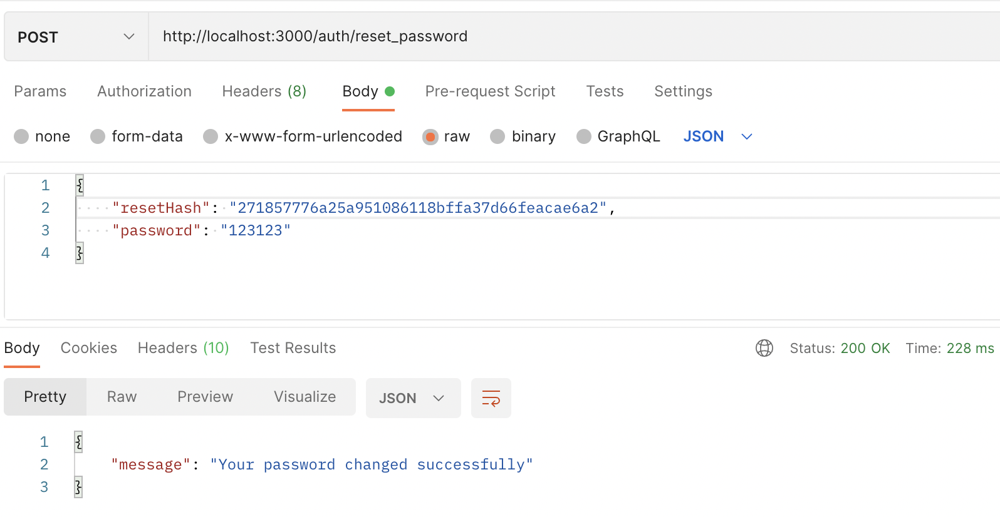

# nest-image-uploader-api

Image uploader api with NestJS

## Tech Stack
NestJS, MongoDB, Redis, RabbitMQ, Microservice, Docker

## Features
- CRUD API
- NoSQL Database with MongoDB Atlas
- Token based authentication with JWT
- Cache with Redis
- Queue with Redis
- Mail Service as Microservice with RabbitMQ
- Storage with Cloudinary
- E2E Tests
- Rate limiter
- Global error handling
- Run with Docker

## Installation

- Clone git repository `git clone https://github.com/yusufborucu/nest-image-uploader-api`
- Go to image-uploader-api directory `cd image-uploader-api`
- Copy `.env.example` file and create `.env` file
- Modify the `.env` file in accordance with your database, cloudinary and mail settings.
- Go to mail-service directory `cd mail-service`
- Copy `.env.example` file and create `.env` file
- Modify the `.env` file in accordance with your mail settings.
- Run with Docker `docker-compose up`

## Run the e2e tests
- **Important:** It is recommended to use test database when running tests.
- `npm run test:e2e`

## Request examples

### Register

### Login

### Forgot Password

### Reset Password

### Token Test

### Create Image

### Get Images

### Update Image

### Delete Image

